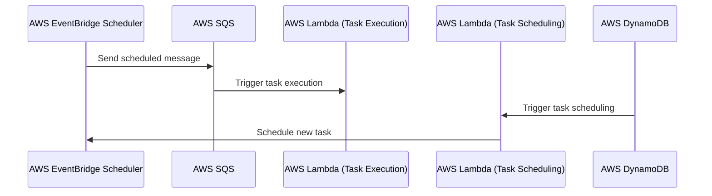

# 🏗 Architecture Documentation

## 📖 Context
The repository is designed to facilitate task scheduling and execution using AWS services. It leverages AWS Lambda functions to process tasks and schedule them using AWS EventBridge Scheduler. The primary goal is to automate task scheduling and execution in a scalable and serverless manner, providing business value by reducing manual intervention and improving operational efficiency.

### Notable Services and Libraries:
- **AWS Lambda**: Used for running serverless functions to process tasks.
- **AWS SQS (Simple Queue Service)**: Acts as a message queue for task processing.
- **AWS DynamoDB**: Utilized for storing task-related data and triggering events.
- **AWS EventBridge Scheduler**: Manages the scheduling of tasks.
- **AWS IAM**: Manages access control and permissions for AWS resources.
- **Terraform**: Infrastructure as Code (IaC) tool used to provision and manage AWS resources.
- **Rust**: Programming language used for implementing the Lambda functions.
- **Serde**: Rust library for serializing and deserializing data.
- **Tokio**: Asynchronous runtime for Rust.

## 📖 Overview
The architecture is built around serverless principles, utilizing AWS Lambda for executing tasks and AWS EventBridge Scheduler for scheduling them. The system is designed to handle task scheduling and execution in a decoupled manner, using AWS SQS for message queuing and AWS DynamoDB for data storage and event triggering.

### Key Components:
- **Task Scheduling Module**: Manages the scheduling of tasks using AWS EventBridge Scheduler.
- **Task Execution Module**: Processes tasks using AWS Lambda functions triggered by SQS messages.
- **Infrastructure Management**: Terraform scripts to provision and manage AWS resources.

### Interaction:
- Tasks are scheduled using AWS EventBridge Scheduler, which sends messages to an SQS queue.
- AWS Lambda functions are triggered by SQS messages to execute tasks.
- DynamoDB streams trigger Lambda functions to process new data entries and schedule tasks.

### Design Patterns:
- **Event-Driven Architecture (EDA)**: Utilizes events from DynamoDB and SQS to trigger Lambda functions.
- **Serverless Architecture**: Leverages AWS Lambda and other serverless services to minimize infrastructure management.

## 🔹 Components

| Component                  | Description                                                                                   | Interaction                                                                 |
|----------------------------|-----------------------------------------------------------------------------------------------|-----------------------------------------------------------------------------|
| Task Scheduling Module     | Manages task scheduling using AWS EventBridge Scheduler.                                      | Interacts with AWS SQS to send scheduled messages.                          |
| Task Execution Module      | Processes tasks using AWS Lambda functions.                                                   | Triggered by messages from AWS SQS.                                         |
| AWS SQS                    | Acts as a message queue for task processing.                                                  | Receives messages from EventBridge Scheduler and triggers Lambda functions. |
| AWS DynamoDB               | Stores task-related data and triggers events.                                                 | Triggers Lambda functions via streams.                                      |
| AWS EventBridge Scheduler  | Schedules tasks and sends messages to SQS.                                                    | Interacts with AWS SQS to manage task scheduling.                           |
| Terraform                  | Manages infrastructure provisioning and configuration.                                        | Deploys and configures AWS resources.                                       |

## 🔄 Data Flow

| Data Source                | Data Destination          | Description                                                                 |
|----------------------------|---------------------------|-----------------------------------------------------------------------------|
| AWS EventBridge Scheduler  | AWS SQS                   | Sends scheduled messages to SQS for task execution.                         |
| AWS SQS                    | AWS Lambda (Task Execution)| Triggers Lambda functions to process tasks.                                 |
| AWS DynamoDB               | AWS Lambda (Task Scheduling)| Triggers Lambda functions to schedule tasks based on new data entries.      |

## 🔍 Mermaid Diagram

## 🧱 Technologies

| Technology                 | Description                                                                                   |
|----------------------------|-----------------------------------------------------------------------------------------------|
| AWS Lambda                 | Serverless compute service for running code.                                                  |
| AWS SQS                    | Message queuing service for decoupling components.                                            |
| AWS DynamoDB               | NoSQL database service for storing task data.                                                 |
| AWS EventBridge Scheduler  | Service for scheduling tasks and events.                                                      |
| Terraform                  | Infrastructure as Code tool for managing AWS resources.                                       |
| Rust                       | Programming language used for implementing Lambda functions.                                  |
| Serde                      | Rust library for data serialization and deserialization.                                      |
| Tokio                      | Asynchronous runtime for Rust.                                                                |

## 📝 **Codebase Evaluation**

### Objective:
Analyze the provided codebase for technical debt, focusing on dependency & coupling, code complexity, and cloud anti-patterns.

### Evaluation:
- **Dependency & Coupling**: The codebase effectively uses AWS services, but there is a tight coupling between Lambda functions and specific AWS services (e.g., SQS, DynamoDB). Consider abstracting AWS service interactions to reduce coupling.
- **Code Complexity**: The use of async functions and error handling is appropriate, but the complexity could be reduced by modularizing the code further, especially in the `process_records` functions.
- **Cloud Anti-patterns**: No hardcoded secrets are present, and environment variables are used appropriately. However, ensure that IAM roles and policies are as restrictive as possible to follow the principle of least privilege.

### Suggestions:
- **Refactoring**: Consider creating utility functions or modules to handle AWS service interactions, reducing code duplication and improving maintainability.
- **Modularity**: Break down large functions into smaller, more manageable pieces to improve readability and testability.
- **Security**: Review IAM policies to ensure they are not overly permissive and follow best practices for AWS security.