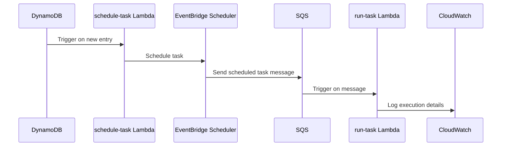

# 🏗 Architecture Documentation

## 📖 Context
* **Goal of the Repository**: This repository is designed to facilitate task scheduling using AWS services. It leverages AWS Lambda functions to process tasks and schedule them using AWS EventBridge Scheduler. The primary business value is to automate task scheduling and execution, which can be particularly useful in applications requiring timed or event-driven task execution.
* **Notable Code Libraries and Services**:
  - **AWS Lambda**: Used for running serverless functions to process tasks.
  - **AWS SQS (Simple Queue Service)**: Utilized for message queuing between components.
  - **AWS DynamoDB**: Serves as a data store with streams enabled for event-driven processing.
  - **AWS EventBridge Scheduler**: Used for scheduling tasks based on events.
  - **AWS IAM**: Manages permissions and roles for secure access to AWS resources.
  - **Terraform**: Infrastructure as Code (IaC) tool used to provision and manage AWS resources.

## 📖 Overview
* **Architecture Overview**: The architecture is centered around AWS services, primarily using Lambda functions to handle task processing and scheduling. Key components include:
  - **Task Scheduling Module**: Manages the scheduling of tasks using AWS EventBridge Scheduler.
  - **Lambda Functions**: Two main functions, `run-task` and `schedule-task`, handle task execution and scheduling, respectively.
  - **DynamoDB**: Stores task-related data and triggers events for new entries.
  - **SQS**: Acts as a message broker between components, ensuring reliable task processing.
* **Component Interactions**:
  - **Event-Driven Flows**: DynamoDB streams trigger Lambda functions to process new data entries.
  - **API Calls**: Lambda functions interact with AWS services like EventBridge Scheduler and SQS through API calls.
  - **Storage Mechanisms**: Data is stored in DynamoDB, and logs are managed via CloudWatch.
* **Design Patterns and Architectural Decisions**:
  - **Serverless Architecture**: Utilizes AWS Lambda for scalable, event-driven processing.
  - **Event-Driven Architecture (EDA)**: Employs DynamoDB streams and SQS for asynchronous processing.
  - **Infrastructure as Code (IaC)**: Uses Terraform for consistent and repeatable infrastructure deployment.

## 🔹 Components
| Component                  | Description                                                                                   |
|----------------------------|-----------------------------------------------------------------------------------------------|
| `task_scheduling` module   | Manages task scheduling using AWS EventBridge Scheduler.                                      |
| `run-task` Lambda function | Processes tasks from SQS messages and performs necessary actions.                             |
| `schedule-task` Lambda function | Schedules new tasks based on DynamoDB stream events.                                      |
| DynamoDB                   | Stores task data and triggers events for new entries.                                         |
| SQS                        | Queues messages for task processing, ensuring reliable and decoupled communication.           |
| IAM Roles and Policies     | Securely manage permissions for Lambda functions and other AWS services.                      |

## 🔄 Data Flow
| Data Flow Step                          | Description                                                                                   |
|-----------------------------------------|-----------------------------------------------------------------------------------------------|
| DynamoDB Stream -> `schedule-task` Lambda | New entries in DynamoDB trigger the `schedule-task` Lambda to schedule tasks.                  |
| `schedule-task` Lambda -> EventBridge Scheduler | Schedules tasks using EventBridge Scheduler based on processed DynamoDB entries.               |
| SQS -> `run-task` Lambda                | Messages in SQS trigger the `run-task` Lambda to execute tasks.                               |
| `run-task` Lambda -> CloudWatch Logs    | Logs task execution details to CloudWatch for monitoring and debugging.                        |

## 🔍 Mermaid Diagram

## 🧱 Technologies
| Technology          | Description                                                                 |
|---------------------|-----------------------------------------------------------------------------|
| AWS Lambda          | Serverless compute service for running code in response to events.          |
| AWS SQS             | Message queuing service for decoupling and scaling microservices.           |
| AWS DynamoDB        | NoSQL database service with stream support for event-driven architectures.  |
| AWS EventBridge Scheduler | Service for scheduling tasks based on time or events.                     |
| AWS IAM             | Service for managing access to AWS resources securely.                      |
| Terraform           | Infrastructure as Code tool for provisioning and managing AWS resources.    |
| Rust                | Programming language used for implementing Lambda functions.                |

## 📝 **Codebase Evaluation**
* **Dependency & Coupling**: The codebase effectively uses AWS services, but there is a tight coupling between Lambda functions and specific AWS services (e.g., SQS, DynamoDB). Consider abstracting AWS service interactions to improve modularity.
* **Code Complexity**: The use of async functions and error handling is appropriate, but the complexity could be reduced by breaking down large functions into smaller, more manageable units.
* **Cloud Anti-Patterns**: 
  - **Hardcoded Values**: Ensure environment variables are used for configuration instead of hardcoded values.
  - **Error Handling**: Improve error handling by implementing retries or fallback mechanisms for failed operations.
* **Actionable Suggestions**:
  - Refactor Lambda functions to separate concerns and improve readability.
  - Use environment variables for all configuration settings to enhance flexibility and security.
  - Implement a retry mechanism for transient errors in AWS service interactions.